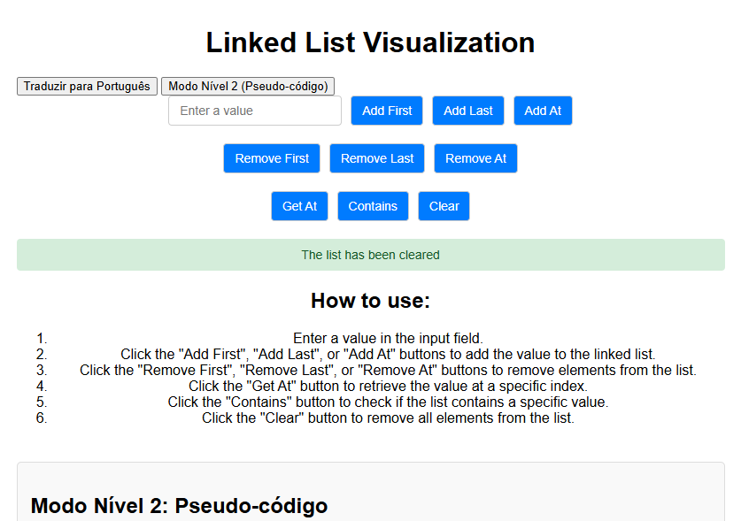
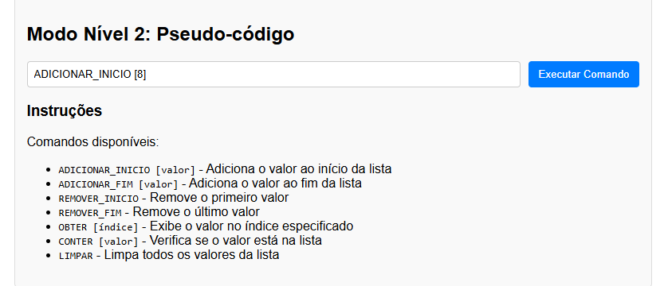

# Linked List Visualization Web Application

## Overview
This project is a web-based application that visualizes the behavior of a linked list data structure. It provides an interactive interface for users to perform various operations on a linked list and a pseudo-code mode for an alternative, algorithmic view of the operations. 

The application is designed to be educational, offering visual and interactive demonstrations of data structure operations.




---

## Features
- **Interactive Visualization:** Add, remove, and query elements in a linked list through an intuitive UI.
- **Dual Modes:** 
  - Standard mode with buttons for common operations.
  - Level 2 (Pseudo-code) mode for command-line style operations with instructions in Portuguese.
- **Dynamic Feedback:** Visual feedback is provided in the form of a dynamic list display.
- **Guidance:** Built-in guides and instructions for both standard and pseudo-code modes.
- **Multilingual Support:** Button for switching to a Portuguese interface for localization.

---

## Technologies Used

### Frontend
1. **HTML5**:
   - Semantic structure for the webpage.
   - Utilizes `<div>` and `<input>` elements for layout and user interaction.

2. **CSS3**:
   - Responsive design using media queries.
   - Styled buttons, input fields, and containers for an aesthetically pleasing UI.
   - Organized layout with `flexbox` for alignment and spacing.

3. **JavaScript**:
   - Handles dynamic DOM manipulation.
   - Implements core linked list operations and pseudo-code parsing.
   - Event-driven programming with `addEventListener`.

### Backend (in-browser functionality)
- **Linked List Data Structure**:
  - Implemented using JavaScript classes.
  - Supports:
    - Add operations (`addFirst`, `addLast`, `addAt`).
    - Remove operations (`removeFirst`, `removeLast`, `removeAt`).
    - Query operations (`getAt`, `contains`).
  - Methods adhere to OOP principles.

### Localization
- Multilingual interface supported using event-driven toggling between English and Portuguese.

---

## Techniques and Methodologies

### User-Centered Design (UCD)
- **Ease of Use**: The design prioritizes clarity and simplicity, making it accessible for users at various skill levels.
- **Guided Interaction**: Detailed instructions and pseudo-code options cater to both visual and textual learning preferences.

### Object-Oriented Programming (OOP)
- Encapsulation of linked list logic into reusable JavaScript classes.
- Abstraction of complex data structure logic from the user interface.

### Dynamic DOM Manipulation
- Dynamically updates the list view on every user action.
- Displays messages to guide and inform users about their actions.

### Event-Driven Architecture
- Each button and command input is linked to specific event handlers.
- Pseudo-code execution parses user commands and triggers the corresponding linked list methods.

### Progressive Enhancement
- Basic linked list operations are accessible without pseudo-code.
- Pseudo-code mode enriches the experience for advanced users.

---

## How to Use

1. Clone or download the repository.
2. Open `index.html` in a web browser.
3. Use the buttons or pseudo-code mode to interact with the linked list.
4. Switch to Portuguese if desired by clicking "Traduzir para Português."

---

## Future Improvements
- **Persistent Storage**: Use `localStorage` or a backend server to save the linked list state.
- **Animations**: Add transitions for a smoother visual experience.
- **Extended Localization**: Add more languages.
- **Testing**: Implement automated tests for all linked list operations.

---

## File Structure
```
/ (Root Directory)
│
├── index.html       # Main HTML file for structure and layout
├── style.css        # CSS file for styling the application
├── script.js        # JavaScript file for logic and interactivity
├── README.md        # Technical documentation (this file)
```

---

## Conclusion
This Linked List Visualization application serves as an excellent educational tool for learning about data structures. Built using modern web technologies and adhering to best practices in programming and design, it provides a robust and interactive experience for users.